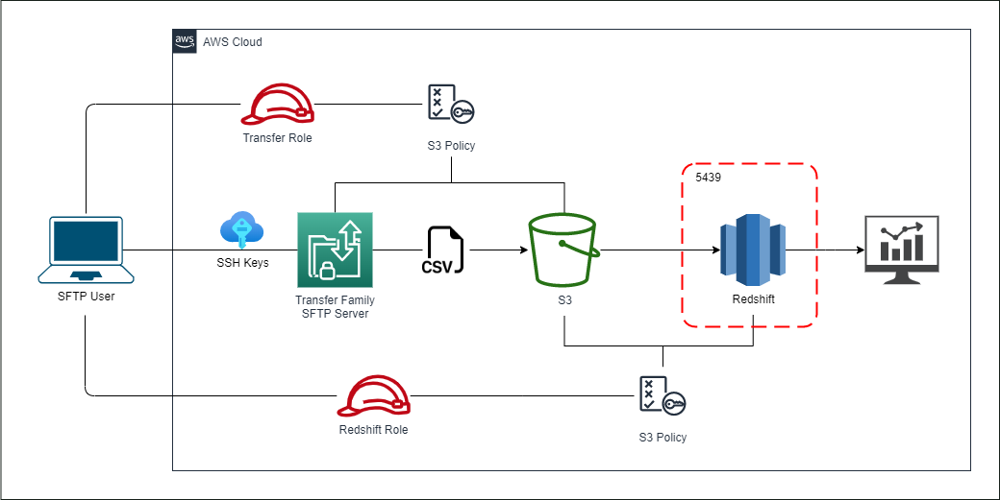
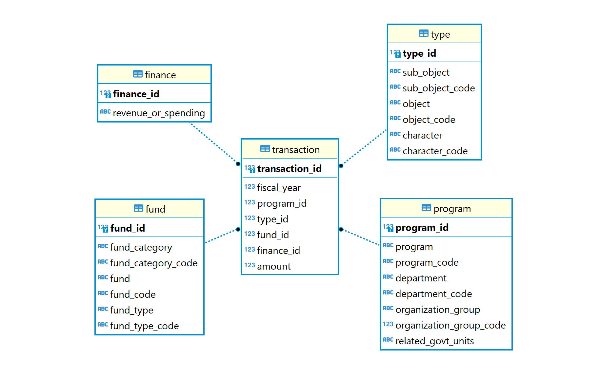
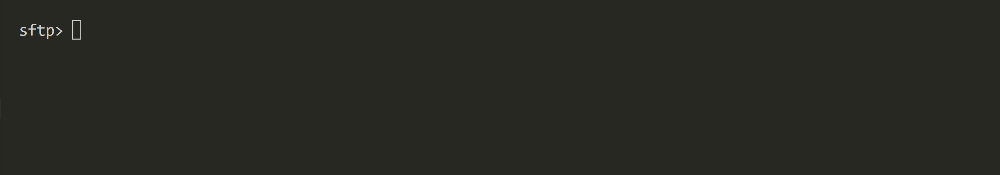

# Project Description
The San Francisco Controller's Office maintains a database of spending and revenue data sourced from it's citywide financial system. Transactions data is scraped from the DataSF official website and conformed into a dimensional model in a data warehouse. The purpose of this data engineering is to help support dashboarding and ad-hoc query from business users.

# Architecture

- **Transfer Family**: Assumes role on the client's behalf as a SSH user to transfer data to a remote AWS server through the SSH File Transfer Protocol (SFTP). SFTP enables secured data transfer from local SFTP-enabled server to the AWS environment over the internet. A pair of SSH keys (public & private) will be required to support user authentication with the SFTP server.
- **S3**: The SFTP server establishes a relationship with the S3 bucket which serves as its persistent file storage system so that data transfered through SFTP will be stored directly S3. All CSV data will be transfered and stored in S3.
- **Redshift**: The Redshift cluster assumes role on the client's behalf to pull data from S3 and load it into the data warehouse reporting area. To enable working with Redshift remotely, a VPC security group is attached to the cluster to route all incoming traffic to port 5439, which is the default port on which Redsfhit database is exposed. 
- **S3 Policies**: Defined the set of actions (e.g GET, DELETE, PUT, etc) allowed to be performed on the S3 bucket by Transfer Family and Redshift assuming roles on the client's behalf, respectively. Transfer Family has permissions to put transfered objects into the bucket, whereas Redshift has permissions to fetch and copy data from the bucket over to the cluster.

# Dimensional Model (ERD)

### Dimension Table
- **Program**: A program identifies the service under which a transaction is recorded. Each program belongs to a department under an organization group.
- **Type**: Specify the detail of resources involved in a transaction. Sub-object indicates the most granular level of detail, and falls under object and character in that order.
- **Fund**: An activity receives governmental funding under a particular category based on its characteristics. Fund category is the lowest level under the hierarchy, falling under fund and fund type in that order.
- **Finance**: Indicates whether a transaction is a spending or a revenue.
### Fact Table
- **Transaction**: The amount of dollars processed in a transaction within an accounting period that begins on July 1 and ends on June 30 the following year.

# Sample Dashboard


# How to Run the Project

**1. Preliminary Setup**
```bash
pip3 install -r requirements.txt
```
- Make sure AWS account has full access to work with *S3*, *Transfer Famiy*, *Redshift*, and *IAM*
- Follow the [boto3 configuration link](https://boto3.amazonaws.com/v1/documentation/api/latest/guide/quickstart.html#configuration) if boto3 isn't already set up
- Complete the [params.cfg](params.cfg) file where a 'TODO: Replace the value below' indicates

**2. Generate an SSH Key Pair**
- Create a folder called *ssh* in the project root directory
- Generate an RSA 4096-bit key pair in the ssh directory
```bash
ssh-keygen -t rsa -b 4096 -N "" -m PEM -f <key_name>  # TODO: Replace <key_name> with a key name of your choice
```

**3. Build AWS Infrastructures**
```bash
python3 infrastructures.py   # Make sure in the project root directory
```
- After all AWS resources have been provisioned, the SFTP server endpoint will show up on the terminal 

**4. Connect to the Transfer Family SFTP Server**
- Refer to the *sftp_server_username* in [params.cfg](params.cfg)
```bash
sftp -i ssh/<key_name> <sftp_server_username>@<sftp_server_endpoint>
```
- Enter *'yes'* if prompted for connection, you shall be directed to the SFTP terminal



**5. Transfer Local Datasets to S3 Buckets over SFTP**
```bash
put data/.csv
```

<!---
Challenge: 
- Not sure about the relationship between a column and its corresponding code column. 
- Doubted that it should be a one-to-one relationship but there are columns that clearly have multiple codes identified with it. 
- Sent an email to ask the dataset owner, but still get no reply yet.
- Decided that it should be a many-to-one relationship.

Thought Organization:
- Only need a Transfer Family role attached with a access policy that allows it to call S3 on the user's behalf
- Server host key doesn't actually show changes after being updated with ssh private key (keep in mind!)

ETL Steps:
1 For each column and their corresponding code column:
   1.1 handle null values
   1.2 check many-to-one relationship
   1.3 transform the code column if necessary

-------------------------------------------------------------------------------

Local Step:
1. Generate a SSH key pair (public & private)
2. Scrape the data from official website
3. Configure AWS account on CLI
   3.1 - Store access key on local ./aws folder
4. Fill in the config file
5. Transfer the file to S3 through SFTP (after Boto3 step 4 is completed)
   - SFTP server's endpoint
   - SSH private key

Boto3 Step:
1. Set up an S3 bucket 
2. Create IAM role
   2.1 - Create an IAM policy for services to call S3 on user's behalf
      2.1.1 - Specify the target S3 bucket in the policy
   2.2 - Create a Transfer Family role and attach the policy to it
      2.2.2 - Establish a trust relationship between AWS and Transfer Family
      2.2.1 - Attach managed policies for Transfer Family to work with S3 
3. Set up an SFTP server with Transfer Family
   3.1 - Store data in S3 as domain
   3.2 - Submit the SSH private key content
4. Create a user to attach to the server
   4.1 - Attach the Transfer Family role to the user
   4.2 - Submit the SSH public key content
5. Set up a Redshift cluster
   5.1 - Attach the Redshift role to the cluster
      5.1.1 - Policy for working with S3 bucket 
      5.1.2 - Redshift full access
   5.2 - Create a security group that routes inbound traffic to port 5439
   
Cloud Steps:
1. Set up star schema in the Redshift DW
2. Copy the transformed data from S3 into Redshift 
3. Create report 
   3.1 - Aggregation result
   3.2 - Dashboard for features

--------------------------------------------

Production:
1. Infrastructure (Boto3)
   1.1 - Environment variables
      1.1.1 - AWS account ID
      1.1.2 - Region Name
      1.1.3 - S3 Bucket Name
      1.1.4 - Transfer Family Role Name
      1.1.5 - Transfer Family S3 Policy Name
      1.1.6 - Transfer Family AWS Permission Policies
      1.1.7 - SFTP Server Username
      1.1.8 - Redshift Role Name
      1.1.9 - Redshift S3 Policy Name
      1.1.10 - Redshift Cluster Name
      1.1.11 - Redshift Database Name
      1.1.12 - Redshift Database Username
      1.1.13 - Redshift Database Password
2. Initial Load (boto3)
   2.1 - Create a report schema in Redshift database
   2.2 - Define dimensional tables
      2.2.1 - copy dimensional data from S3 over to Redshift
   2.3 - Define fact table
      2.3.1 - copy fact data from S3 over to Redshift

-----------------------------------------------------------

Clean Up:
1. Delete Redshift Cluster
2. Delete Security Group
3. Delete the Redshift Role
4. Delete the SFTP Server
5. Delete the Transfer Family Role
6. Delete the S3 Policy for Transfer Family
7. Empty and Delete the S3 bucket

-----------------------------------------------
Room for Improvement:
1. Set up Glue catalog to store tables metadata
   1.1 - For incremental loading
   1.2 - For sharing data with other users
2. Set up an identity provider like Otka for better management
--->
